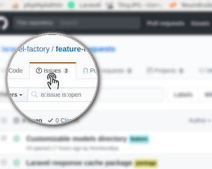
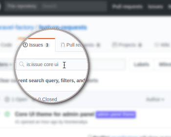
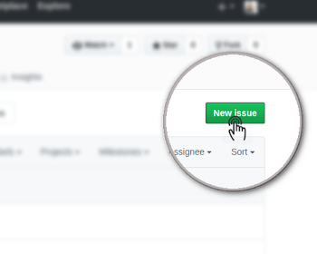

## Request a feature for [Codotype](https://codotype.io)
This repository is used to track feature requests for Codotype. We use GitHub Issues to track features - please follow the steps below:

|||
|--|--|
|**Step 1:** Click on the `Issues` tab at the top|  |
|**Step 2:** Search the [Open Issues](https://github.com/codotype/feature-requests/issues) to check if similar request is already submitted. If it is, please comment on the issue with a :+1: and any additional information.| |
|**Step 3:** If not, please create a [New Issue](https://github.com/codotype/feature-requests/issues/new) for your feature request - we'll take a look and tag it accordingly. We appreciate your feedback!||

---

Thanks to [Laravel Factory](https://github.com/laravel-factory/feature-requests) for the inspiration and images used in this `README`.